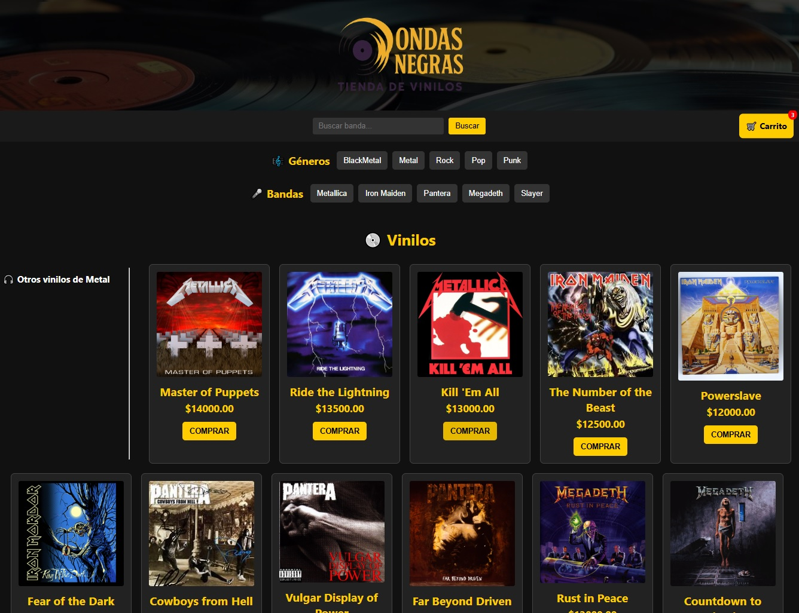
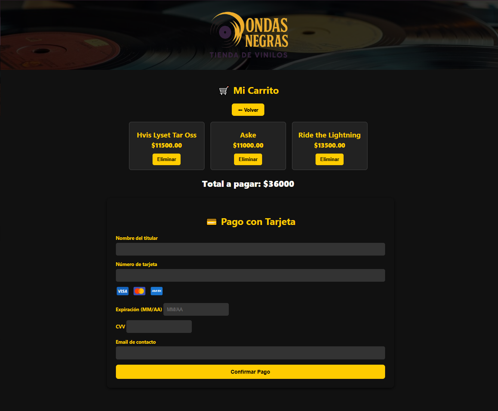

# Proyecto Vinilos 2.0 

## Descripción

**Proyecto Vinilos 2.0** es una tienda web interactiva de vinilos de diferentes géneros musicales, donde los usuarios pueden explorar géneros, bandas, buscar vinilos, ver detalles y agregarlos a un carrito de compras. El proyecto combina **frontend en HTML, CSS y JavaScript** con **backend en Node.js y Express** y **base de datos MySQL**.

---

## Funcionalidades

1. **Explorar Géneros Musicales**
   - Botón que carga todos los géneros disponibles desde la base de datos.
   - Cada género muestra las bandas correspondientes.

2. **Explorar Vinilos por Género y Banda**
   - Al seleccionar un género, se muestran todos los vinilos de ese género.
   - Botones de bandas permiten destacar los vinilos de cada banda.

3. **Buscador**
   - Permite filtrar vinilos por nombre de banda.
   - Muestra un mensaje si no se encuentran resultados.

5. **Imágenes de Vinilos**
   - Cada vinilo tiene su imagen correspondiente.
   - Si no existe, se muestra una imagen genérica.
-----

4. **Carrito de Compras**
   - Los vinilos se pueden agregar al carrito.
   - La información se guarda en `localStorage`.
   - Contador dinámico de productos en el carrito.

---

## Tecnologías Utilizadas

- **Frontend**
  - HTML5
  - CSS3
  - JavaScript (Vanilla)
- **Backend**
  - Node.js
  - Express
  - MySQL (vía `mysql2`)
- **Otros**
  - LocalStorage para carrito de compras
  - Fetch API para consumir datos del backend

---

## Estructura del Proyecto

PROYECTO_VINILOS2.0/
│
├─ backend/
│ ├─ node_modules/
│ ├─ db.js # Conexión a MySQL
│ ├─ server.js # Servidor Express y rutas API
│ ├─ package.json
│ └─ package-lock.json
│
├─ frontend/
│ ├─ img/ # Imágenes de vinilos y banner
│ ├─ index.html
│ ├─ carrito.html
│ ├─ style.css
│ └─ script.js
│
└─ sql/
└─ init.sql # Script para crear base de datos y cargar datos

## Base de Datos

- **Base de datos:** `vinilos`
- **Tablas:**
  - `generos`: id, nombre
  - `bandas`: id, nombre, genero_id
  - `vinilos`: id, nombre, precio, banda_id
- **Datos iniciales:** 5 géneros, 25 bandas, 75 vinilos.

